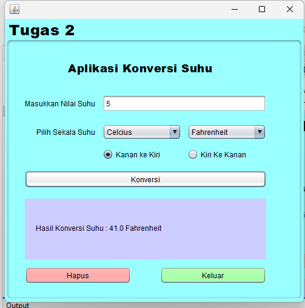

# AplikasiPenghitungUmur
 
Aplikasi Konversi Suhu adalah sebuah aplikasi berbasis Java yang membantu pengguna untuk melakukan konversi suhu dari satu skala ke skala lainnya, seperti Celsius, Fahrenheit, Kelvin, dan Reamur.

# Keunggulan Aplikasi

- *Mudah dan Cepat*: Aplikasi ini memungkinkan pengguna untuk mengonversi suhu dengan cepat hanya dengan beberapa klik.
- *Antarmuka Sederhana*: Didesain menggunakan Java , aplikasi ini menawarkan antarmuka yang intuitif.
- *Konversi Akurat*: Menggunakan rumus konversi yang tepat untuk memastikan hasil akurat.

# Pembuat Aplikasi
 Muthya Adylla - 2210010476 - Latihan 2

# Fitur

Aplikasi ini memiliki beberapa fitur utama sebagai berikut:

1. *Konversi Suhu ke Berbagai Skala*
   
2. *Input Suhu yang Fleksibel*
Pengguna dapat memasukkan nilai suhu pada kolom input, kemudian memilih skala asal dan skala tujuan untuk melakukan konversi.

3. *Antarmuka Pengguna yang Sederhana dan Mudah*
Antarmuka dibangun menggunakan Java Swing, dengan input sederhana untuk memasukkan nilai suhu dan pilihan skala. Hasil konversi ditampilkan dengan jelas di layar.

## Cara Menjalankan

1. Clone repositori ini ke dalam komputer Anda atau unduh sebagai ZIP.
2. Buka proyek di IDE pilihan Anda.
3. Pastikan Anda mengatur JDK yang benar di IDE Anda.
4. Jalankan PenghitungUmurFrame untuk memulai aplikasi.

# Demo

